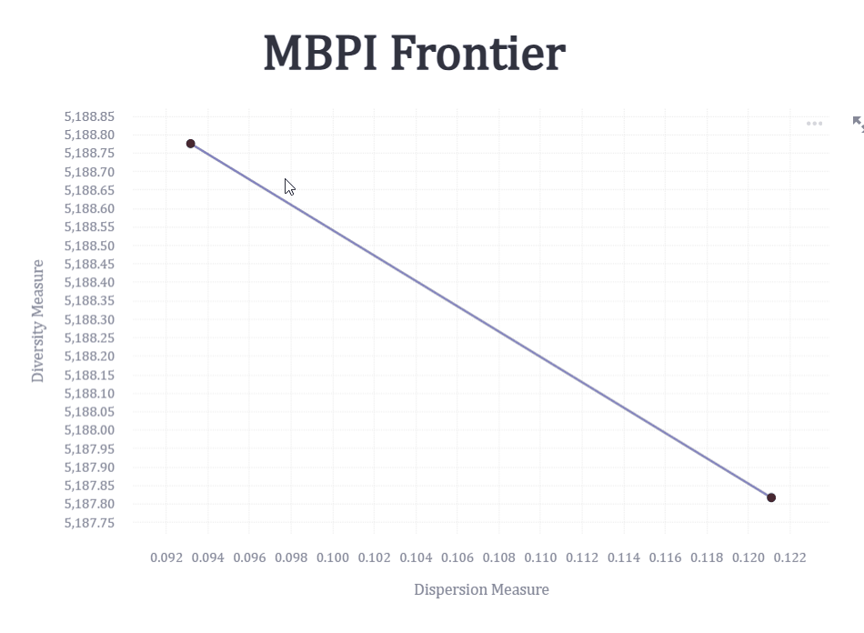

# Multi-restart Bicriterion Pairwise Interchange

This repository contains a Python implementation of the Multi-restart Bicriterion Pairwise Interchange (MBPI) algorithm for the anticlustering problem. The algorithm, proposed by Brusco et al., is a bicriterion stochastic search method for finding a Pareto set of maximally dissimilar partitions across a metric space.

This implementation works for **variably sized groups**.

For more information on the algorithm, please refer to the [original paper](https://pubmed.ncbi.nlm.nih.gov/31512759/) as well as this project's corresponding [blog post](https://amasoumnia.com/blog/2024-07-28-anticluster/) for a more detailed explanation.